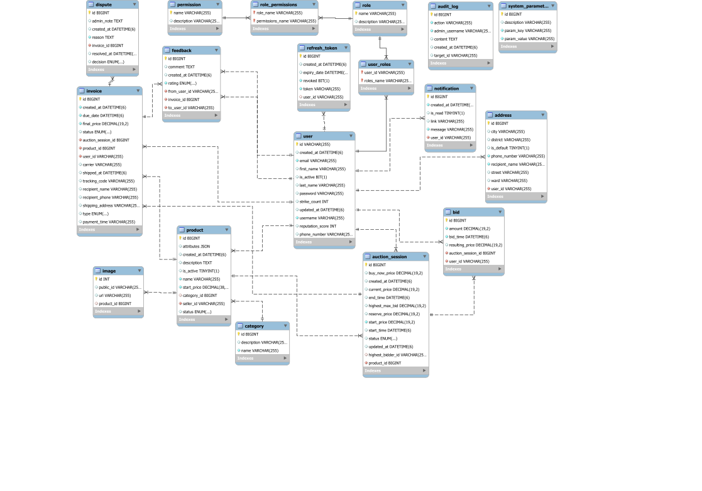

# Auction Proxy Bidding

Backend API cho hệ thống đấu giá trực tuyến theo mô hình gần với eBay, tập trung vào luồng đấu giá ủy quyền (proxy bidding), thanh toán qua VNPay, quản lý tranh chấp và bảo mật bằng JWT. Project được xây dựng bằng Spring Boot, ưu tiên cung cấp API ổn định cho frontend và các tích hợp liên quan.

## Mục Tiêu

- Phát triển backend cho hệ thống đấu giá trực tuyến, trong đó người bán đăng sản phẩm, quản trị viên duyệt sản phẩm, người bán tạo phiên đấu giá và người mua đặt giá.
- Thiết kế logic đấu giá ủy quyền cốt lõi: người đấu giá có thể đặt mức giá tối đa, hệ thống tự động cạnh tranh theo bước giá hợp lệ.
- Hỗ trợ thanh toán qua VNPay cho phí niêm yết và hóa đơn mua hàng sau khi thắng đấu giá.
- Hỗ trợ cập nhật giá thầu trực tiếp cho client thông qua lớp realtime hiện có, nhưng không gắn chặt thiết kế nghiệp vụ vào một công nghệ realtime cụ thể.
- Triển khai bảo mật bằng JWT, Redis để quản lý token/OTP, phân quyền vai trò và các luồng xác thực cần thiết.
- Cung cấp các luồng quản trị như duyệt sản phẩm, quản lý phiên đấu giá, hóa đơn, tranh chấp, audit log và thông số hệ thống.

## Tính Năng Chính

- Xác thực và phân quyền bằng JWT, refresh token, OTP và Google OAuth custom flow.
- Quản lý người dùng, vai trò, quyền, địa chỉ và hồ sơ công khai.
- Quản lý danh mục, sản phẩm và ảnh sản phẩm qua Cloudinary.
- Duyệt sản phẩm trước khi cho phép tạo phiên đấu giá.
- Tạo và quản lý phiên đấu giá với trạng thái `SCHEDULED`, `ACTIVE`, `ENDED`, `FAILED` và `WAITING_PAYMENT`.
- Đặt giá theo proxy bidding, có cooldown, bước giá theo bậc và khóa pessimistic khi xử lý bid.
- Tạo hóa đơn phí niêm yết cho đấu giá có giá sàn, hóa đơn mua hàng cho người thắng đấu giá và tích hợp thanh toán VNPay.
- Quản lý giao hàng, xác nhận hoàn tất đơn hàng, tự động hoàn tất sau thời gian cấu hình và xử lý tranh chấp.
- Ghi nhận feedback, uy tín người dùng, strike và chặn/deactivate tài khoản khi có vi phạm thanh toán.
- Thông báo và cập nhật thời gian thực cho các sự kiện đấu giá quan trọng.

## Công Nghệ Sử Dụng

- Java 23
- Spring Boot 3.4.x
- Spring Web, Spring Security, Spring Data JPA, Spring Validation
- MySQL
- Redis
- JWT Resource Server
- OpenFeign cho Google OAuth custom flow
- VNPay sandbox/payment API
- Cloudinary
- Java Mail Sender
- Lombok và MapStruct
- Socket.IO hiện là lớp realtime đang cấu hình trong backend
- Maven

## Cấu Trúc Dự Án

```text
src/main/java/com/thanh/auction_server
├── Controller/          # REST controllers
├── configuration/       # Security, JWT, Cloudinary, realtime config
├── constants/           # Enum/trạng thái/hệ số cấu hình
├── dto/                 # Request/response DTOs
├── entity/              # JPA entities
├── exception/           # Exception và global handler
├── mapper/              # MapStruct mappers
├── repository/          # JPA repositories và OpenFeign clients
├── service/             # Business logic
├── specification/       # Dynamic query specifications
└── validation/          # Custom validators
```

Tài liệu bổ sung:

- [API_DOC.md](docs/api/API_DOC.md): danh sách endpoint cho frontend.
- [DTO_DOC.md](docs/api/DTO_DOC.md): request/response DTO.
- [openapi.yaml](docs/api/openapi.yaml): OpenAPI specification.
- [docs/database/ERD.svg](docs/database/ERD.svg): sơ đồ ERD.

## ERD



## Luồng Nghiệp Vụ Chính

1. Người bán tạo sản phẩm.
2. Quản trị viên duyệt sản phẩm. Chỉ sản phẩm `ACTIVE` mới được tạo phiên đấu giá.
3. Người bán tạo phiên đấu giá cho sản phẩm đã duyệt.
4. Nếu phiên đấu giá có giá sàn, hệ thống tạo hóa đơn `LISTING_FEE`; phiên đấu giá chờ thanh toán trước khi được kích hoạt.
5. Scheduler tự động chuyển phiên đấu giá từ `SCHEDULED` sang `ACTIVE`, sau đó sang `ENDED` hoặc `FAILED`.
6. Người mua đặt giá theo proxy bidding. Người bán không được đặt giá hoặc mua sản phẩm của chính mình.
7. Khi kết thúc phiên đấu giá, người thắng nhận hóa đơn `AUCTION_SALE` và cần có snapshot địa chỉ trước khi thanh toán.
8. VNPay cập nhật kết quả thanh toán.
9. Người bán giao hàng, người mua xác nhận hoàn tất hoặc mở tranh chấp.
10. Quản trị viên xử lý tranh chấp bằng cách hoàn tiền hoặc hoàn tất hóa đơn.

## Điều Kiện Chạy Local

Cần cài đặt:

- JDK 23
- MySQL
- Redis
- Maven hoặc Maven wrapper có sẵn trong repo

Các dịch vụ/tài khoản tích hợp cần cấu hình khi chạy đầy đủ tính năng:

- VNPay sandbox
- Cloudinary
- Gmail SMTP hoặc SMTP tương thích
- Google OAuth

## Biến Môi Trường

Không commit secret trực tiếp vào repository. Cấu hình các biến môi trường sau trước khi chạy ứng dụng:

```env
GOOGLE_CLIENT_ID=
GOOGLE_CLIENT_SECRET=
AUCTION_EMAIL_USER=
AUCTION_EMAIL_PASS=
AUCTION_JWT_SIGNER_KEY=
CLOUDINARY_KEY=
CLOUDINARY_SECRET=
VNPAY_TMN_CODE=
VNPAY_HASH_SECRET=
```

Giá trị mặc định quan trọng trong profile dev:

- API port: `8081`
- API context path: `/api/v1`
- MySQL dev URL: `jdbc:mysql://localhost:3307/auction_db`
- Redis dev: `localhost:6379`
- Realtime port hiện tại: `9092`

## Cách Chạy

Windows:

```powershell
.\mvnw.cmd spring-boot:run
```

Linux/macOS:

```bash
./mvnw spring-boot:run
```

Nếu Maven wrapper không hoạt động trong môi trường local, có thể dùng Maven đã cài trên máy:

```bash
mvn spring-boot:run
```

Sau khi khởi động, API chạy tại:

```text
http://localhost:8081/api/v1
```

## Kiểm Thử Và Build

Chạy test:

```bash
./mvnw test
```

Build artifact:

```bash
./mvnw clean package
```

Kiểm tra compile nhanh:

```bash
mvn -DskipTests compile
```

Một số test context có thể cần MySQL tại `localhost:3307`. Nếu chưa có database local, có thể chạy các test tập trung theo service khi cần kiểm tra logic riêng.

## Ghi Chú Cho Reviewer

- Backend ưu tiên API và logic nghiệp vụ, phù hợp để tích hợp với frontend riêng.
- Tài liệu API chi tiết nằm trong `docs/api/API_DOC.md` và `docs/api/openapi.yaml`.
- ERD nằm tại `docs/database/ERD.svg`.
- Lớp realtime hiện tại chỉ là cách triển khai cập nhật trực tiếp cho client; logic đấu giá cốt lõi nằm trong service và có thể được tích hợp với cơ chế realtime khác nếu cần.
